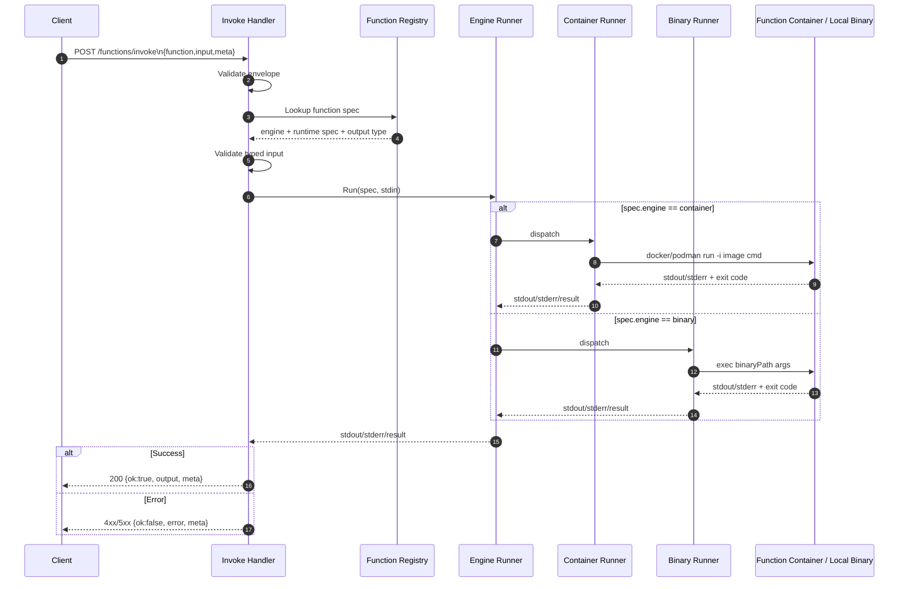

# go-hydra

`go-hydra` is a Go HTTP service prototype that demonstrates one global API surface where each request behaves like a function call: JSON input arrives over HTTP, is passed to a runtime engine over stdin, and stdout is returned in a structured response.

The core idea is to use pluggable execution engines (container and binary) for a lightweight Function-as-a-Service pattern that can fan out horizontally for scale.

Current function contracts include:

- `text.uppercase` (implemented and validated end-to-end)
- `render.url_to_pdf` (contract defined, runtime command/image still placeholder)
- `convert.markdown` (contract defined, experimental and not yet validated end-to-end)

## Architecture (Infographic)

```mermaid
flowchart LR
    A[Client] --> B[POST /functions/invoke]
    B --> C[Invoke Handler]
    C --> D[Validate Envelope\nfunction, input, meta]
    D --> E{Function Known?}
    E -- no --> F[404 unknown_function\nJSON error envelope]
    E -- yes --> G[Function Registry Lookup]
    G --> H[Validate Typed Input\n422 on contract errors]
    H --> I[Engine Runner]
    I --> J{FunctionSpec.engine}
    J -->|container| K[Container Runner]
    J -->|binary| L[Binary Runner]
    K --> M{Container Engine Available}
    M -->|docker| N[docker run -i IMAGE CMD]
    M -->|podman fallback| O[podman run -i IMAGE CMD]
    N --> P[Container stdin/stdout]
    O --> P
    L --> Q[Local binary exec\nBINARY_PATH ARGS]
    Q --> R[Binary stdin/stdout]
    P --> S{Execution OK?}
    R --> S
    S -- no --> T[500 container_execution_failed\nJSON error envelope]
    S -- yes --> U[Map stdout to output payload]
    U --> V[200 OK\nJSON success envelope]
```





## Local Run (prototype)

1. Ensure Docker or Podman is installed and running.
2. Install Go dependencies.
3. Start the server.

Example:

```bash
go run ./cmd/go-hydra
```

## Invoke Contract

Canonical endpoint:

- `POST /functions/invoke`

Request envelope:

```json
{
  "function": "text.uppercase",
  "input": { "text": "hello" },
  "meta": {
    "request_id": "demo-1",
    "timeout_ms": 30000
  }
}
```

Example call:

```bash
curl -s -X POST "http://127.0.0.1:8080/functions/invoke" \
  -H "Content-Type: application/json" \
  -d '{"function":"text.uppercase","input":{"text":"hello hydra"},"meta":{"request_id":"demo-1","timeout_ms":30000}}'
```

## Design Docs Workflow

System design docs are scaffolded under `docs/design/`.

- They are currently ignored in git via `.gitignore` while drafting.
- To start tracking them, remove the `docs/design/` line from `.gitignore`.
- After unignoring, add and commit the folder normally.

## Notes

- Current storage for todos is in-memory.
- Runtime is local-first and supports container or binary execution backends behind the same invoke schema.
- Container execution currently keeps exited containers for debug visibility (no `--rm`), so clean up periodically when needed.
